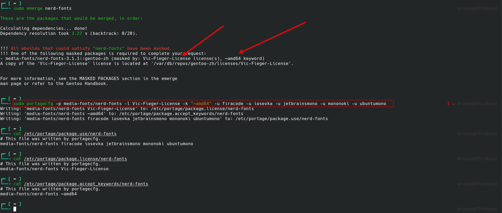
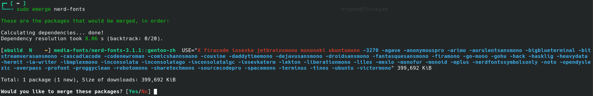
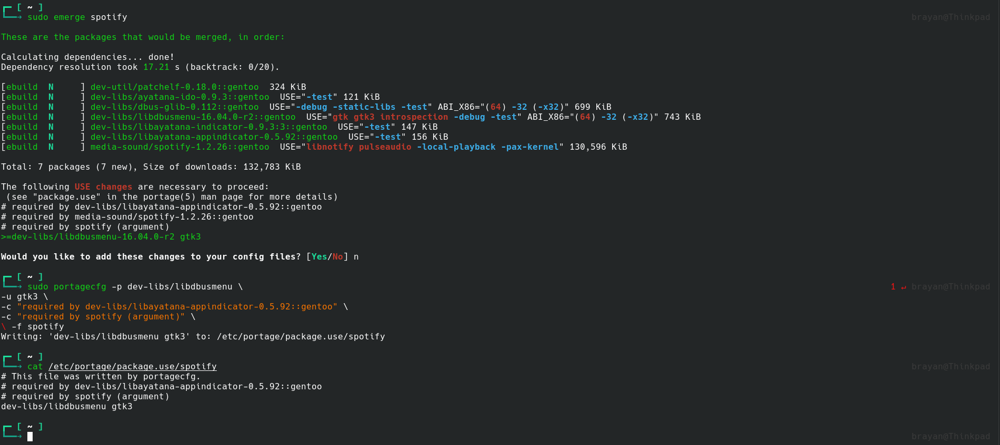
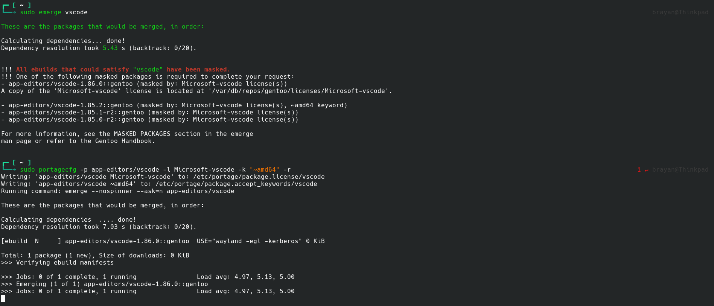
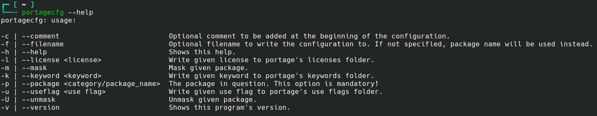

# portagecfg
Utility to write portage configs files in an easy manner.

# How to set it up
## First thing first, get the sources, and get into the sources directory.

```
git clone https://github.com/brookiestein/portagecfg
cd portagecfg
```

## Then compile it.
```
mkdir build
cmake -G Ninja -S . -B build
cmake --build build
```

## And if you want to just type `portagecfg` from wherever you are, install it.

`cmake --build build --target install`

It'll be installed in `/usr/local/bin`

## Usage
It's as simple as type: `portagecfg -p sys-kernel/gentoo-sources -u symlink`

That will write `sys-kernel/gentoo-sources symlink` into `/etc/portage/package.use/gentoo-sources`.

You can also combine some use flags by just appending another -u per use flag. That's the same as for licenses, and keywords.

`portagecfg -p app-emulation/qemu -u usbredir -u alsa -u bzip2 -k "~amd64"`

That'll write `app-emulation/qemu usbredir alsa bzip2` into `/etc/portage/package.use/qemu`, and

`app-emulation/qemu ~amd64` into `/etc/portage/package.accept_keywords/qemu`

## Other usage examples
### Usage example 1 (continues)

### Usage example 1 (continued)

### Usage example 2

### Usage example 3


## Help

