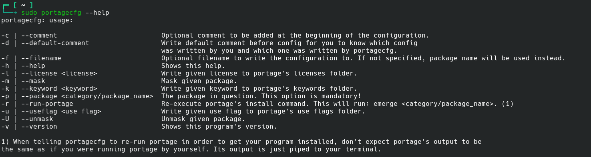

# portagecfg
Utility to write portage configs files in an easy manner.

# Dependencies
```
QtCore
```

# How to set it up
## First thing first, get the sources, and get into the sources directory.

```
git clone https://github.com/brookiestein/portagecfg
cd portagecfg
```

## Then compile it.
```
mkdir build
cmake -G Ninja -S . -B build -DCMAKE_PREFIX_PATH=/usr
cmake --build build
```

## And if you want to just type `portagecfg` from wherever you are, install it.

`sudo cmake --build build --target install`

It'll be installed in `/usr/bin`.

## Usage
It's as simple as typing: `portagecfg -p sys-kernel/gentoo-sources -u symlink`

That will write `sys-kernel/gentoo-sources symlink` into `/etc/portage/package.use/gentoo-sources`.

You can write several USE flags using either of these notations:
```
portagecfg -p app-emulation/qemu --useflags="usbredir alsa bzip2"
portagecfg -p app-emulation/qemu -u usbredir\ alsa\ bzip2
```
Both are valid ways of passing several values to any of the available options.

You can also combine differents options for the same package, for example:
```
portagecfg -p app-emulation/qemu --useflags="usbredir alsa bzip2" -k "~amd64"
```

That'll write `app-emulation/qemu usbredir alsa bzip2` into `/etc/portage/package.use/qemu`, and

`app-emulation/qemu ~amd64` into `/etc/portage/package.accept_keywords/qemu`

## Other usage examples
### Usage example 1 (continues)

### Usage example 1 (continued)

### Usage example 2

### Usage example 3


## Help

